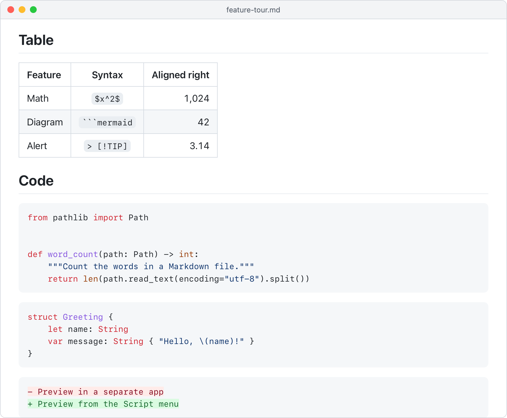
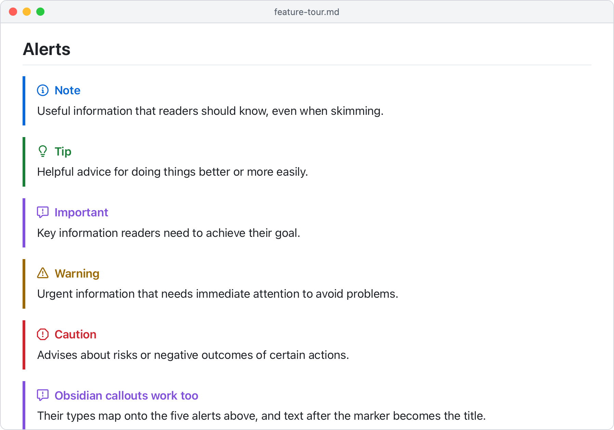

# Markdown Preview for CotEditor

[](https://github.com/mlmeehan/coteditor-markdown-preview/actions/workflows/ci.yml)
[](https://github.com/mlmeehan/coteditor-markdown-preview/releases/latest)
[](LICENSE)

A rich Markdown preview for [CotEditor](https://coteditor.com), the plain-text editor for macOS. Press **⇧⌘M** and the document you're editing opens in your browser, rendered the way GitHub renders it: tables, task lists, footnotes, Mermaid diagrams, math, syntax highlighting, alerts and emoji.

<picture>
  <source media="(prefers-color-scheme: dark)" srcset="docs/images/preview-dark.png">
  
</picture>

CotEditor deliberately doesn't include a preview of its own ([coteditor/CotEditor#722](https://github.com/coteditor/CotEditor/issues/722)). This adds one through CotEditor's Script menu, with nothing extra running in the background.

## Install

Paste this into Terminal:

```sh
/bin/bash -c "$(curl -fsSL https://github.com/mlmeehan/coteditor-markdown-preview/releases/latest/download/install.sh)"
```

The installer:

- adds **Markdown Preview** to CotEditor's Script menu with the shortcut ⇧⌘M,
- installs [cmark-gfm](https://github.com/github/cmark-gfm), GitHub's Markdown renderer, with [Homebrew](https://brew.sh) if you don't have it yet,
- verifies the download against its published checksum, and doesn't need `sudo`.

To read the installer before running it, or check it against the release's checksum first, see [Verifying the installer](SECURITY.md#verifying-the-installer).

Run the same command again whenever you want to update; your shortcut and settings are kept.

**Requirements:** CotEditor on macOS, a current browser (Safari, Chrome, Firefox, Edge or Arc), and cmark-gfm. If you don't use Homebrew, install cmark-gfm with MacPorts (`sudo port install cmark-gfm`) before running the installer.

<details>
<summary>Install by hand instead</summary>

1. Download `coteditor-markdown-preview.tar.gz` from the [latest release](https://github.com/mlmeehan/coteditor-markdown-preview/releases/latest) and unpack it.
2. In CotEditor, choose **Script menu ▸ Open Scripts Folder**. It opens `~/Library/Application Scripts/com.coteditor.CotEditor/`.
3. Copy `Markdown Preview.sh` and the `_markdown-preview` folder into it, and rename the script to `Markdown Preview.@M.sh` to get the ⇧⌘M shortcut.
4. In the `_markdown-preview` folder, duplicate `config.example` and name the copy `config`. That's your [settings](#settings) file.
5. Make the script executable, and clear the quarantine flag your browser added to the download:

   ```sh
   cd ~/Library/Application\ Scripts/com.coteditor.CotEditor
   chmod +x "Markdown Preview.@M.sh"
   xattr -dr com.apple.quarantine "Markdown Preview.@M.sh" _markdown-preview
   ```

6. Install cmark-gfm: `brew install cmark-gfm`.

</details>

## Use it

1. Open a Markdown file in CotEditor.
2. Press **⇧⌘M**, or choose **Script menu ▸ Markdown Preview**.

The preview opens in your web browser. It's a snapshot: after editing, press ⇧⌘M again for a fresh one. Relative links and images resolve against the document's folder, so save new documents before previewing images that sit next to them.

Want to see everything it can do? Download [`feature-tour.md`](https://github.com/mlmeehan/coteditor-markdown-preview/raw/main/examples/feature-tour.md), open it in CotEditor and preview it.

## What it renders

| Feature | Write it like this |
| --- | --- |
| Everything in [GitHub Flavored Markdown](https://github.github.com/gfm/): tables, task lists, strikethrough, autolinks | `\| a \| b \|`, `- [x] done`, `~~old~~`, `www.example.com` |
| Footnotes | `Text[^1]` … `[^1]: The note.` |
| [Mermaid](https://mermaid.js.org) diagrams | a ` ```mermaid ` code block |
| Math with [KaTeX](https://katex.org) | `$inline$`, `$$display$$`, `` $`inline`$ `` or a ` ```math ` block |
| Syntax highlighting for about 60 languages, with a copy button | ` ```python `, ` ```sql `, ` ```swift `, … |
| [Alerts](https://docs.github.com/en/get-started/writing-on-github/getting-started-with-writing-and-formatting-on-github/basic-writing-and-formatting-syntax#alerts) | `> [!NOTE]`, `[!TIP]`, `[!IMPORTANT]`, `[!WARNING]`, `[!CAUTION]` (Obsidian's `> [!info] Title` works too) |
| Emoji shortcodes | `:rocket:` |
| YAML or TOML front matter | shown as a collapsed block instead of stray text |
| A table of contents | `[TOC]` (or `[[TOC]]`) on its own line |
| Raw HTML | `<details>`, `<kbd>`, `<sub>`, `<mark>`, … |

Headings get anchor links that match GitHub's, so `[link](#some-heading)` works the same way in both places. Light and dark mode follow macOS, and the page prints cleanly.

<p>
  <picture>
    <source media="(prefers-color-scheme: dark)" srcset="docs/images/code-dark.png">
    
  </picture>
  <picture>
    <source media="(prefers-color-scheme: dark)" srcset="docs/images/alerts-dark.png">
    
  </picture>
</p>

The [syntax reference](docs/syntax.md) has the details: the callout types, math rules, code block languages and more.

**How it differs from GitHub:** it uses the same parser, so ordinary Markdown renders the same. But raw HTML isn't sanitized the way GitHub does it (only scripts are blocked), `@mentions` and `#123` references stay plain text, and `[TOC]` and callouts are extras GitHub doesn't have. The preview is a snapshot rather than a live view. See [Differences from GitHub](docs/syntax.md#differences-from-github) for the full list.

## Settings

Settings live in a small text file: `~/Library/Application Scripts/com.coteditor.CotEditor/_markdown-preview/config`. Open it in CotEditor, remove the `#` in front of a setting and change its value:

```ini
# The browser that shows previews: an app name or the full path of an app.
# Leave unset for your default browser.
browser = Safari

# auto follows macOS; light or dark always use that appearance.
theme = auto
```

**Your own styles:** create `custom.css` in the same folder. It's added after the built-in styles, and updates never touch it. For example, `body { font-size: 19px; }` or `.page { max-width: 64rem; }`.

**A different shortcut:** run the installer with `--shortcut`, using CotEditor's notation: `^` Control, `~` Option, `$` Shift, `@` Command, then one letter (an uppercase letter adds Shift).

```sh
/bin/bash -c "$(curl -fsSL https://github.com/mlmeehan/coteditor-markdown-preview/releases/latest/download/install.sh)" -- --shortcut '@~p'
```

That one is ⌥⌘P; use `--shortcut none` for no shortcut. You can also rename the script file in the Scripts folder yourself, as described on the *Customize Script menu* page of CotEditor's help (**Help ▸ CotEditor Help**).

## Update, check or uninstall

Update by running the install command again. Your `config` and `custom.css` are kept, and so are copies of the script you made yourself under other names. If you edited the installed script, or another file has its name, it's moved to `_markdown-preview/backup/` first. The other files in `_markdown-preview` are replaced on every update, so keep your changes in `config` and `custom.css`.

Add an option after ` -- ` for the rest:

```sh
# Check the installation and print a report (useful for bug reports)
/bin/bash -c "$(curl -fsSL https://github.com/mlmeehan/coteditor-markdown-preview/releases/latest/download/install.sh)" -- --doctor

# Uninstall (a config or custom.css you changed is kept)
/bin/bash -c "$(curl -fsSL https://github.com/mlmeehan/coteditor-markdown-preview/releases/latest/download/install.sh)" -- --uninstall
```

`--version v1.0.0` installs a specific release, and `--no-deps` skips installing cmark-gfm. cmark-gfm stays installed when you uninstall; remove it with `brew uninstall cmark-gfm`.

## Troubleshooting

Start with the doctor command above: it checks CotEditor, the script, cmark-gfm, the libraries, your settings, then renders a test page. The most common fixes:

- **Nothing in the Script menu:** the script must be in the Scripts folder itself, with a name ending in `.sh`. Reinstalling puts it back.
- **"…can't be executed because you don't have permission":** the script lost its executable flag. Reinstalling fixes it.
- **⇧⌘M does nothing, but the menu item works:** another script or command uses the same shortcut. The installer and doctor point out clashing scripts; a menu shortcut you set in CotEditor's *Settings ▸ Shortcuts* (*Key Bindings* in older versions) or in macOS's *Keyboard Shortcuts* also takes precedence.
- **"It needs cmark-gfm":** run `brew install cmark-gfm`.
- **Diagrams, math or highlighting show as plain text:** the libraries in `_markdown-preview/lib` are missing or damaged. Reinstalling restores them.
- **Something else:** CotEditor's **Window ▸ Console** shows any error the script reported.

The [troubleshooting guide](docs/troubleshooting.md) covers these and more in detail.

## Privacy and security

- Your document is converted on your Mac, and the preview is a file in your temporary folder. Nothing is uploaded.
- Mermaid, KaTeX and its fonts, highlight.js and the emoji list are installed with Markdown Preview, so previews need no internet connection. Pinned versions are downloaded from npm when a release is built, checked against their hashes, and packaged with it; the installer checks the package against its published checksum.
- Images and other files a document links to on the web load as they would in any browser.
- Raw HTML in a document is rendered, but scripts inside the document are blocked by the page's Content Security Policy, as on GitHub.

## How it works

CotEditor passes the document's text to the script, which:

1. runs a small awk pass (`prepare.awk`) that folds front matter and protects `$math$` from Markdown,
2. renders GitHub Flavored Markdown with `cmark-gfm`,
3. writes one HTML page with the styles (`preview.css`) and a script (`preview.js`) that draws diagrams and math, highlights code and adds the finishing touches,
4. opens that page in your browser.

Everything except the menu script lives in `_markdown-preview`, which CotEditor keeps out of the Script menu because its name starts with an underscore.

## Contributing

Bug reports and pull requests are welcome. [CONTRIBUTING.md](CONTRIBUTING.md) explains how the project is laid out and how to run the tests.

## Credits

- The idea started from a preview script [@NayamAmarshe](https://github.com/NayamAmarshe) shared in [CotEditor Discussion #2112](https://github.com/coteditor/CotEditor/discussions/2112); this project is a new implementation.
- Rendering by [cmark-gfm](https://github.com/github/cmark-gfm), [Mermaid](https://mermaid.js.org), [KaTeX](https://katex.org), [highlight.js](https://highlightjs.org) and [markdown-it-emoji](https://github.com/markdown-it/markdown-it-emoji)'s emoji list; alert and copy icons from [Octicons](https://github.com/primer/octicons). See [THIRD-PARTY-NOTICES.md](THIRD-PARTY-NOTICES.md).
- [CotEditor](https://github.com/coteditor/CotEditor) is made by 1024jp and its contributors.

## License

[MIT](LICENSE) © 2026 Michael Meehan
