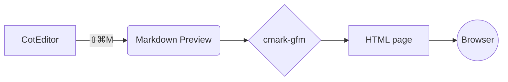
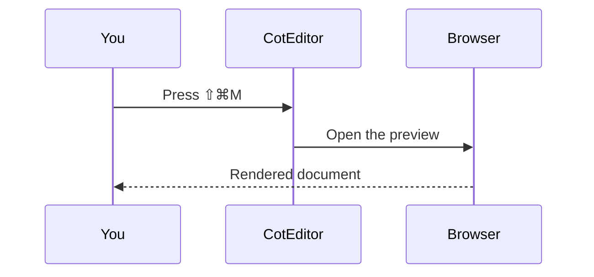

# Markdown Preview feature tour

Open this file in CotEditor and press **⇧⌘M** (or choose **Script ▸ Markdown Preview**) to see everything below rendered. :sparkles:

[TOC]

## Text

You can write **bold**, *italic*, ***both***, ~~strikethrough~~, `inline code`, H<sub>2</sub>O and E = mc<sup>2</sup>. Raw HTML works too: <kbd>⇧</kbd> <kbd>⌘</kbd> <kbd>M</kbd> and <mark>highlighted text</mark>.

Links can be [inline](https://coteditor.com), [relative](feature-tour.md) or bare: https://github.com and www.example.com. Shortcodes become emoji :rocket: :tada: :+1:, but `:not_in_code:` stays as typed.

Prices such as $5 and $10 stay text, while $e^{i\pi} + 1 = 0$ is math. Write \$ for a dollar sign that should never start math.

## Lists

1. Write Markdown in CotEditor
2. Press ⇧⌘M
   - The preview opens in your browser
   - Relative images and links resolve against the document's folder
3. Edit and preview again

- [x] Tables, task lists and footnotes
- [x] Diagrams and math
- [ ] Your next document

## Table

| Feature        | Syntax              | Aligned right |
|:---------------|:-------------------:|--------------:|
| Math           | `$x^2$`             |         1,024 |
| Diagram        | ` ```mermaid `      |            42 |
| Alert          | `> [!TIP]`          |          3.14 |

## Code

```python
from pathlib import Path


def word_count(path: Path) -> int:
    """Count the words in a Markdown file."""
    return len(path.read_text(encoding="utf-8").split())
```

```swift
struct Greeting {
    let name: String
    var message: String { "Hello, \(name)!" }
}
```

```diff
- Preview in a separate app
+ Preview from the Script menu
```

## Math

Inline math such as $\sqrt{a^2 + b^2}$ or GitHub's $`\tfrac{1}{2}mv^2`$ sits in the text, and display math gets its own line:

$$
\begin{aligned}
\nabla \cdot \mathbf{E} &= \frac{\rho}{\varepsilon_0} \\
\nabla \times \mathbf{B} &= \mu_0 \mathbf{J} + \mu_0 \varepsilon_0 \frac{\partial \mathbf{E}}{\partial t}
\end{aligned}
$$

```math
\sum_{k=1}^{n} k = \frac{n(n+1)}{2}
```

## Diagrams





## Alerts

> [!NOTE]
> Useful information that readers should know, even when skimming.

> [!TIP]
> Helpful advice for doing things better or more easily.

> [!IMPORTANT]
> Key information readers need to achieve their goal.

> [!WARNING]
> Urgent information that needs immediate attention to avoid problems.

> [!CAUTION]
> Advises about risks or negative outcomes of certain actions.

> [!example] Obsidian callouts work too
> Their types map onto the five alerts above, and text after the marker becomes the title.

## Images, details and footnotes


<details>
<summary>Click to expand</summary>

Hidden content can hold **Markdown** too.

</details>

Footnotes collect at the end of the page.[^preview] Click the number to jump there and the arrow to come back.[^back]

[^preview]: Markdown Preview renders with cmark-gfm, the same parser GitHub uses.
[^back]: Links inside the page work even though relative paths point at this file's folder.
